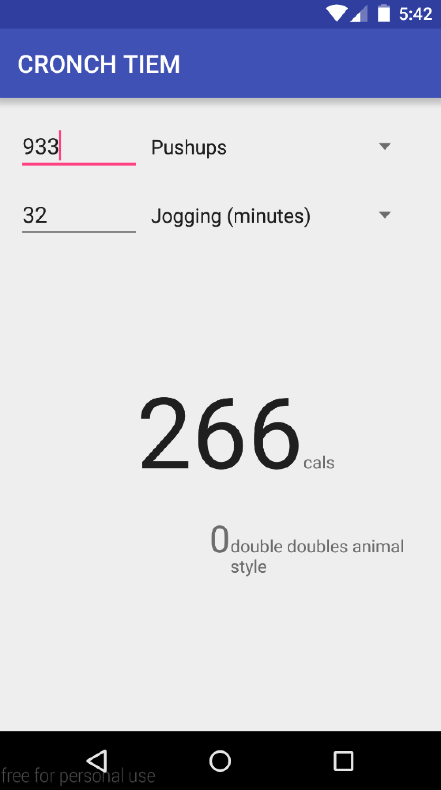

# PROG 01: Crunch Time

It does the things its supposed to do, and one thing more. Hopefully you will find it pleasing.

## Authors

Jeffrey Shi ([jeffster888@berkeley.edu](mailto:jeffster888@berkeley.edu))

## Demo Video

See [muh viddeo] (https://youtu.be/o7KtlAHyzRE)

## Screenshots

## Acknowledgments

* \#TYBG
